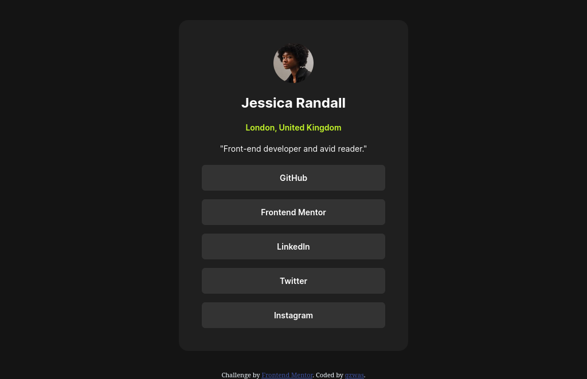
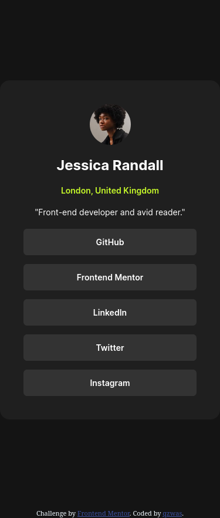

# Frontend Mentor - Social links profile solution

This is a solution to the [Social links profile challenge on Frontend Mentor](https://www.frontendmentor.io/challenges/social-links-profile-UG32l9m6dQ). Frontend Mentor challenges help you improve your coding skills by building realistic projects. 

## Table of contents

  - [Screenshot](#screenshot)
  - [Links](#links)
  - [Built with](#built-with)
  - [What I learned](#what-i-learned)
  - [Continued development](#continued-development)
- [Author](#author)
- [Acknowledgments](#acknowledgments)

### Screenshot
## desktop preview

## mobile preview

### Links

- Solution URL: [profile-links](https://github.com/qzwas/profile-links)
- Live Site URL: [https://qzwas.github.io/profile-links/](https://qzwas.github.io/profile-links/)

### Built with

- Semantic HTML5 markup
- CSS custom properties
- Flexbox

### What I learned

font-face

### Continued development

i wana focus on flexbox

## Author
qzwas

- Frontend Mentor - [@qzwas](https://www.frontendmentor.io/profile/qzwas)

## Acknowledgments

myself

